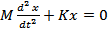
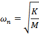

### Theory

### Background:-
**Simple pendulum** : A bob attached to a thread or string hanging from a pivot constitutes a simple pendulum. As the size of the bob is small compared to the length of the thread, the mass of the bob can be considered to be concentrated at its centre and treated as a point mass. The mass of the thread is very small compared to that of the bob, it is neglected. Also, the thread is considered inelastic and inextensible and effects due to these properties are neglected while studying the oscillations of the bob about the pivot. Thus, the bob oscillates about the pivot when disturbed from its equilibrium position and left to its own. The period of such oscillations is given by 

These oscillations are undamped natural vibration of the simple pendulum. Physical systems like a swing in children's park, load hanging from a cable of a crane, can be modelled as simple pendulum.
**Compound Pendulum** : Consider the oscillations of a solid body about the point of suspension 'O' (pivot) as shown in the figure. 

The pivot is at point O and the centre of mass of the body is at G. Let the distance between the pivot and the centre of mass of the body be L. When the body is displaced from its equilibrium position and left to its own, it oscillates about O. Such an arrangement is called compound pendulum. Unlike simple pendulum, the mass is distributed all along the length of the oscillating body and takes part in the oscillations. Equation of motion of the compound pendulum is derived by taking moments of the inertia-force and force due to gravity about the pivot 'O' and is given by 

Where, J0, M, and θ are respectively the mass moment of inertia of the oscillating body about the pivot, total mass of the oscillating body, and angle of oscillation (angle between the line OG while oscillating and the vertical position of equilibrium).  The period of oscillation of a compound pendulum is obtained from solution of above equation and is given by,

(Period of oscillation = Time required to complete one oscillation)

Mass moment of inertia about the centre of mass, 'G', is given by 

**Mass Moment of Inertia** : Moment of a point mass m about another point or a line is given by the product of the mass m and distance between another point or perpendicular distance between the line and location of the mass.  For a solid body, its mass is distributed all over its volume.  So when we want to calculate its mass moment of inertia about a point, every elemental mass of the body is at different distance from the point about which we want to take its moment.  So we resort to use of calculus and find the mass moment of the body by integrating the product of the elemental mass and its square of its distance from the another point under consideration.  Another point of consideration is usually the centre of gravity of the body itself and we find the mass moment of inertia of the body about its own centre of gravity.  Thus for a slender rod, which can be considered as one-dimensional body, the mass moment about its centre of gravity is given by,                                                                                                                    

Similarly, we can find mass moment of inertia for a two or three dimensional solids using double or triple integration. However, finding mass moment of inertia of solids using analytical expressions as above is possible only for solids of regular geometry like a cylinder and sphere. For solids of irregular geometry like a connecting rod or any link use in a mechanism of any machine, the analytical method cannot be used and we need to use an experimental method as discussed in the present experiment.
 
 
Importance of knowing mass moment of inertia: Machines have several parts (links) connected to each other that have linear or angular motion with changing acceleration which result in inertia forces and moments. In order to calculate the moments due to inertia, we must know the mass moment of inertia of the part that has angular motion about a point. The mass moment of inertia of the part (or a link) can be found from period of oscillation of the compound pendulum formed by pivoting the link and setting it into oscillations as explained earlier.

**Vibratory systems around us**

Here are some examples of physical systems where the vibrations are prominent and can be observed easily. In musical instruments the vibrations are intentional. The parts of musical instruments are designed so that they generate sounds that are pleasant to listen. In many cases the vibrations are unwanted and we try to minimize them.

1.   A chandelier hanging from ceiling oscillates to and fro following an initial disturbance; maybe due to a breeze of air.

2.   The oscillations of the chandelier at cathedral of Pisa, Italy, were studied by the famous scientist Galileo Galilee.

3.   A load attached at end of a wire-rope of a crane oscillates to and fro due to initial disturbance; maybe due to sudden stopping of carriage of the crane while revolving about the vertical axis.

4.   The pendulum used in clock of olden days used to oscillate to and fro once every second. i.e. it had a period of oscillation of one second.

5.   String of a guitar, when plucked and left to its own, vibrates and makes a musical sound. It comes to rest after a while; the vibrations die out. Similarly, the diaphragm of a table vibrates when hit and left to its own. It also comes to rest after some time.

All these are examples of vibratory systems that are set into vibration following an initial disturbance. All these systems have three components: mass, due to which the system possesses inertia; elasticity, due to which potential energy can be stored; and components that dissipate energy causing the vibratory motion to be damped which bring them to rest after some time.
      
Vibration or vibratory systems are classified in number of ways. Some of the classifications are given below: 

 **Free and forced vibration** - A free vibration occurs due to initial displacement or velocity, or both, applied to the system only initially. There is no external force acting on the system when the system is vibrating. A forced vibration occurs when the system vibrates in response to external force applied continuously. When the force applied is periodic, i.e. it repeats itself after a fixed interval of time, the forced vibration is called periodic. If the periodic force and hence the resulting vibration varies sinusoidally with respect to time, the vibration is called harmonic. If the force is not periodic, the forced vibration is called aperiodic or random.

 **Damped and undamped vibration** -
When the vibratory system has elements that offer resistance to motion, energy is continuously dissipated and the free vibrations of such systems come to halt after some time. This is called damped vibration and such systems are called damped systems. Forced vibration of a damped system continues as long as the force acts but some of the work done by the external force is lost in overcoming the resistance offered by the damping elements. Systems without damping elements are called undamped systems and their vibrations are called undamped vibrations. All systems in nature have some or the other damping element and their natural vibrations are damped. Hence they come to rest after some time following free vibrations. Nevertheless, we study the vibration of undamped systems because the concepts developed in studying them are useful in analyzing and understanding the phenomena occurring in vibration of damped as well as complicated systems. When the force of resistance offered by a damping element is proportional to velocity of mass of the system, it is termed as viscous damping and the damping element is called a viscous damper. If the force of resistance has a constant value, it is termed as Coulomb damping. Damping due to dry friction shows this kind of behavior. Coulomb damping can occur when the system has components rubbing over each other. There are other types of damping also which shall be discussed later.

**Degrees of freedom** : The vibratory systems are classified as single-degree-of-freedom systems, Multi-degree-of-freedom-systems or continuous systems. The number of degrees of freedom corresponds to the number of independent co-ordinates required to completely describe the motion of the system. In fact, it is the sum of the possible ways each mass can move independently of other masses. The translation of a mass along the three axes, X, Y and Z, and the three rotations about each of these axes constitute possible ways of motion of a mass. Many times, many of these six motions of a mass are restricted and a mass can have one or two degrees of freedom, i.e. only translation or translation and rotation of a single mass about any one of the axes.

**Linear and Non-linear Vibrations** : Vibration is said to be linear if the damping force is proportional to velocity, inertia force is proportional to mass, and restoring force is proportional to displacement. If any of this proportionality is not satisfied, the system is said to be non-linear.

**Solving engineering problems** : Analytical methods are usually applied to models of actual systems. We carry out experiments on models if physical systems are not available for testing. While preparing such models, we exclude superfluous details of the system but include all essential and important features of the actual system. While doing so, we idealize and approximate important behaviour of the system without affecting much the accuracy in predicting the behaviour. The system model so developed provides ease of application of analytical and experimental techniques. Once a satisfactory model is developed, laws of Physics can be applied which give a set of mathematical equations relating the properties and variables of the system. Such a set of mathematical equations is called mathematical model of the system. Solving the set of equations (or a single mathematical equation) provides expression for the system variable in terms of location and time. We call this as 'solution' of the problem. As an illustration of the concepts described above, see the example given below.

<table>
<tr>
<td>Physical system</td><td colspan="2">These days we have number of towering buildings.  Many a times the residential part of such a building is supported on a tall concrete structure.  One of such buildings is the 'Milad Tower', situated in Tehran, Iran.  Its head consists of a large pod with 12 floors and below is a staircase and elevators to reach the area.

The oscillations of such tall buildings, in response to earthquake and wind, are important from design point of view.  And to study these oscillations, we must know the characteristics of its natural vibration. 

Analysis of such a physical system can be very much complicated.  To obtain first rough estimate of the natural frequency of vibration, the problem can be stated and the physical system can be modeled in a simple way as described below.</td>

<td>Problem statement</td><td colspan="2">To find natural frequency of oscillation of the tower in the direction perpendicular to the vertical axis (i.e. natural frequency of transverse oscillation of the tower) and position of the head at any given time.</td>
<td>Physical model of the system</td><td></td><td>The physical model for the system under consideration can be as shown in This is the simplest model.  Only the mass of the building at the top is considered and it is considered to be concentrated at one point.  The mass of the vertical pillar supporting the buiding is neglected and is considered to be a cantilever offering only elesticity.

Thus it becomes a single degree of freedom system with single mass and only one way of motion of the mass: translation in direction perpendicular to the vertical axis of the building.  Further we assume that the amplitude of this motion to be small.

The equivalent stiffness of the cantilever is given by </td>
</tr>

</table>
.  The symbols carry their usual meanings.

**Mathematical model**

Using Newton's second law of motion, the equation of motion of the mass is written as

The first term is the inertia force which is equal to mass multiplied by acceleration and the second term is the spring force given by stiffness of the spring multiplied by its elongation or compression.

The differential equation is a mathematical model of the system.

**General Solution**

The solution to the above differential equation is given by

A and B are constants that depend the initial conditions, i.e. the displacement and velocity of the mass when we started measuring our time.

These are known as initial conditions.

 is the natural frequency in radians per second and is given by

**Particular solution obtained from the initial conditions**

Substituting the initial conditions in above expression, we can obtain the values of A and B.  Thus if X0 and V0 are the initial displacement and velocity, respectively, given to the mass, the above expression will yield values of A and B as  and

Now the expression for x becomes

And we can obtain the value of x at any time t from this expression.

Thus we have obtained the expressions for natural frequency and position of the head at any given time 't' and the problem stated by the problem statement is solved.
