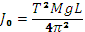

### Procedure

1. Weigh the connecting rod using a balance available in the laboratory and record its mass, M. Find location of the centre of gravity of the connecting rod and mark it as G. 

2. Rest the connecting rod on the peg fitted on the wall. Leave enough clearance between the connecting rod and the wall so that the connecting rod can oscillate freely in vertical plane. This forms a compound pendulum. 

3. Measure the distance between the centre of gravity and the point 'O' on the connecting rod on which it is supported on the peg. Record the distance OG as L.
 
4. Displace the connecting rod by a small angle in the vertical plane and leave it to its own to oscillate.
 
5. Using the stop watch, measure and record the time required to complete ten oscillations of the connecting rod.
 
6. Repeat the process thrice and take average of the time taken for ten oscillations. This is to average out the errors in measurement. Since time taken for ten oscillations is recorded, one tenth of this time is the time period of oscillations of the connecting rod, the compound pendulum. Record this period as T.
 
7. Calculate the moment of inertia of the connecting rod about the pivot, i.e. point 'O' from the expression
 
8. Calculate mass moment of inertia of the connecting rod about its centre of gravity, G, from

9. Minimum 3 calculations are necessary to plot the graph.

 